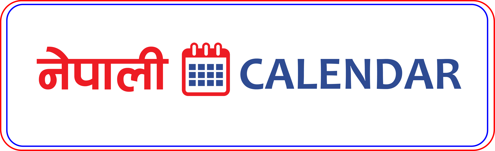

<p align="left"></p>

# Nepali Calendar

The **Nepali Calendar** is a comprehensive PHP package for generating and managing a Nepali calendar. It acts as a wrapper for the `dipesh/nepali-date` package, enabling users to easily create a full Nepali calendar and manage events within it, all without needing extensive knowledge of the Nepali date system.

## Features

- **Comprehensive Nepali Calendar**: Generate and work with a complete Nepali calendar.
- **Event Management**: Add, update, and manage events for each day.
- **Dynamic Event Handling**: Add events using callables or arrays, allowing integration with databases or other sources.
- **Intuitive Navigation**: Simple methods for navigating months and years.

## Installation

To install the Nepali Calendar package, use Composer:

```bash
composer require dipesh/calendar
```

## Usage

### Basic Setup

Create a new calendar instance. By default, it initializes to the current date, but you can provide a specific date if needed.

```php
use Dipesh\Calendar\Calendar;

// Create a new calendar instance with the current date
$calendar = new Calendar();

// Create a new calendar instance with a specific date
$specificDate = '2079/01/01'; // Nepali date format
$calendar = new Calendar($specificDate);
```

### Setting Events

Add events for specific days using the `setEvent` method. You can also set multiple events at once with the `setEvents` method.

#### Adding a Single Event

```php
// Add a single event on the 1st of the month
$calendar->setEvent(1, 'New Year Celebration');
```

#### Adding Multiple Events

You can use an associative array of events or a callable function for dynamic event setting.

```php
// Define an array of events
$events = [
    14 => 'Valentine\'s Day Celebration',
    28 => 'End of Month Gathering',
];

// Set multiple events at once
$calendar->setEvents($events);
```

### Navigating the Calendar

Easily move through the months and years:

```php
// Move to the next month
$calendar->nextMonth();

// Move to the previous month
$calendar->prevMonth();

// Move to the next year
$calendar->nextYear();

// Move to the previous year
$calendar->prevYear();
```

### Using Callbacks for Dynamic Event Fetching

Define a callable function to fetch and set events dynamically, such as from a database.

```php
// Function to fetch events from a database
$fetchEvents = function ($calendarInstance, $days) {
    // Simulated database fetch
    $dbEvents = [
        5 => 'Public Holiday',
        15 => 'Community Event',
    ];

    // Add events to the calendar
    foreach ($dbEvents as $day => $event) {
        $calendarInstance->setEvent($day, $event);
    }
};

// Set events using the callback function
$calendar->setEvents($fetchEvents);
```

## Contributing

Contributions are welcome! If you have suggestions, improvements, or bug fixes, please submit a pull request or open an issue.

## License

This package is licensed under the MIT License. For more details, see the [LICENSE](LICENSE) file.
